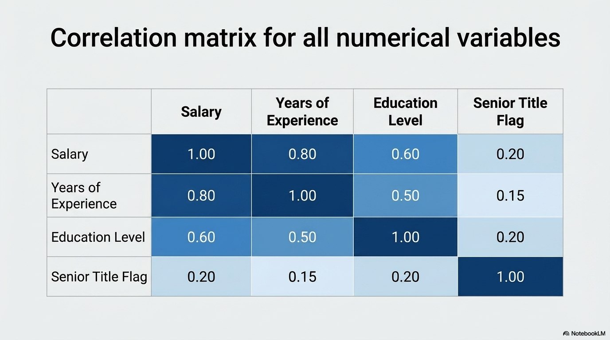
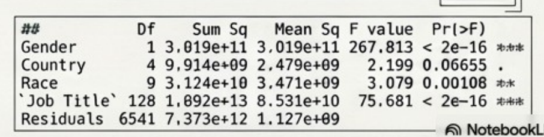
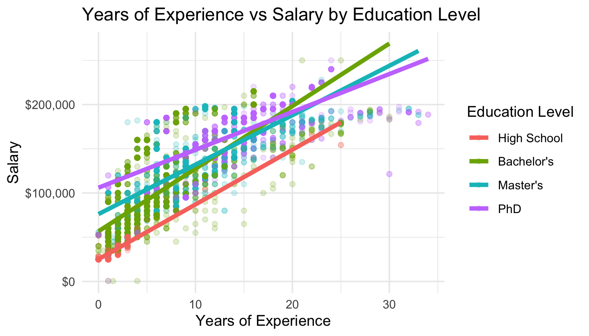
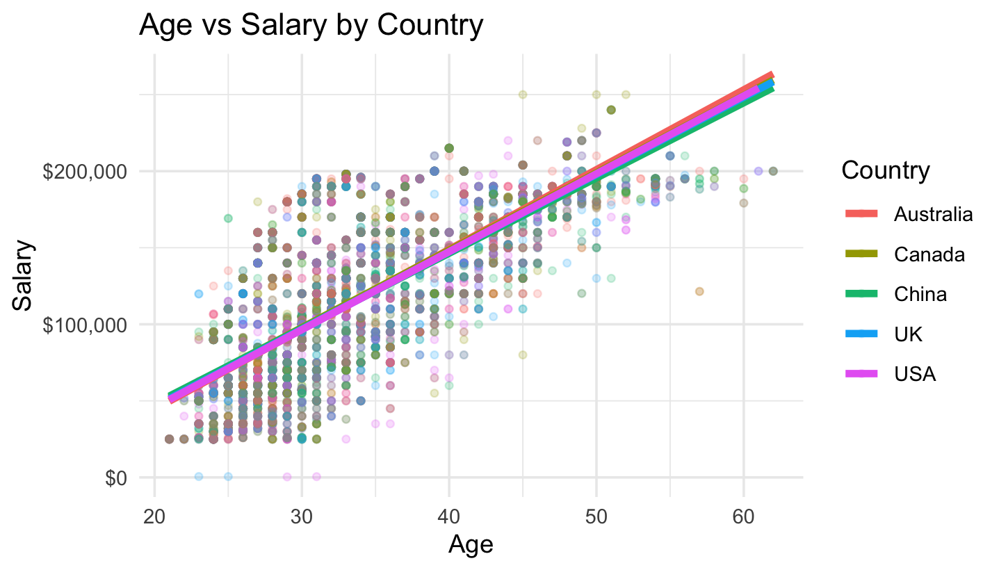
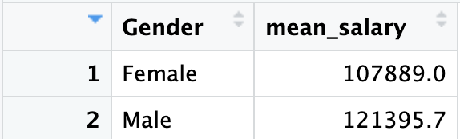

# Salary Determinants: Correlation, Regression, ANOVA, and Chi-Square Analysis in R

## Overview
A two-part inferential statistics project on 6,684 salary records, examining which factors drive compensation and who reaches senior status.

**Part 1** establishes what predicts salary, moving from correlation through multi-factor ANOVA into a multiple linear regression that explains 70.9 percent of salary variance.

**Part 2** shifts from prediction to equity, using chi-square tests of independence to ask whether education and race are associated with reaching senior status, and ANOVA to quantify the gender pay gap.

## Dataset
6,684 employee records across 9 variables, spanning 129 unique job titles and 5 countries, with no missing values.

| Column | Type | Description |
|---|---|---|
| `Age` | Numerical | Employee age, 21 to 62 |
| `Gender` | Categorical | Male or Female |
| `Education Level` | Ordinal | 0 = High School, 1 = Bachelor's, 2 = Master's, 3 = PhD |
| `Job Title` | Categorical | 129 distinct titles |
| `Years of Experience` | Numerical | Years in the field |
| `Salary` | Numerical | Annual compensation, the response variable |
| `Country` | Categorical | USA, UK, Canada, Australia, China |
| `Race` | Categorical | 10 categories |
| `Senior` | Binary | 1 if the title carries senior status, 0 otherwise |

---

# Part 1: What Predicts Salary?

## Correlation Analysis

Pearson correlations against salary rank the numerical predictors clearly:

| Variable | r with Salary |
|---|---|
| Years of Experience | **0.81** |
| Age | 0.73 |
| Education Level | 0.65 |
| Senior | 0.22 |

Years of experience is the dominant numerical driver. Age follows closely, but the two are correlated at **0.94** with each other — age is functionally a proxy for time in the field rather than an independent effect. This multicollinearity becomes important in the regression below.

Senior status is a surprisingly weak numerical correlate at 0.22, which motivated the seniority analysis in Part 2.

## Multi-Factor ANOVA on Categorical Variables

Correlation only handles numerical variables, so a four-factor ANOVA tested whether the categorical variables shift salary.

| Factor | Df | F value | p |
|---|---|---|---|
| Gender | 1 | 267.813 | < 2e-16 |
| Country | 4 | 2.199 | 0.06655 |
| Race | 9 | 3.079 | 0.00108 |
| Job Title | 128 | 75.681 | < 2e-16 |
| Residuals | 6,541 | | |

Gender and Job Title are both highly significant. Job Title carries by far the largest sum of squares (1.892e+13), which makes intuitive sense: an administrative assistant and a software engineer diverge in pay immediately regardless of identical experience.

Country fails to reach significance (p = 0.067), meaning salary does not differ meaningfully across the five countries once other factors are accounted for.

## Visualizing the Relationships

Plotting experience against salary separated by education level shows both an intercept effect and a slope effect.

PhD holders start highest, entering around $105K at zero experience versus roughly $25K for high school. But the slopes differ: Bachelor's and Master's lines rise more steeply and overtake the PhD line past roughly 18 to 20 years. Higher education buys a strong starting position, while the steepest long-run growth appears among Bachelor's holders in this dataset.

By contrast, plotting age against salary separated by country produces five nearly identical, overlapping lines.

This visually confirms the ANOVA result: country contributes essentially nothing to salary variation here.

## Multiple Linear Regression

A model combining numerical and categorical predictors was fit:

`Salary ~ Age + Years of Experience + Education Level + Gender + Country + Race`

| Statistic | Value |
|---|---|
| Multiple R² | 0.7090 |
| Adjusted R² | 0.7082 |
| Residual standard error | 28,525 on 6,666 df |
| F-statistic | 955.2 on 17 and 6,666 df, p < 2.2e-16 |

Key coefficients:

| Predictor | Estimate | Interpretation |
|---|---|---|
| (Intercept) | 93,404 | Baseline |
| Years of Experience | **+8,334** | Each additional year adds about $8.3K |
| Education Level | **+15,146** | Each step up the education ladder adds about $15.1K |
| Gender (Male) | **+6,928** | Male employees earn about $6.9K more, holding other factors constant |
| Age | **−2,239** | Each additional year of age *reduces* predicted salary by about $2.2K |

**The model explains 70.9 percent of salary variance.** Years of experience and education level are the strongest predictors, with gender contributing a smaller but clearly non-zero effect.

**The negative age coefficient is a multicollinearity artifact, not a real finding.** Because age and experience correlate at 0.94, the model has already absorbed the career-progression effect into the experience term. What remains for age to explain is the residual: among two people with the *same* years of experience, the older one entered the field later, and the model penalizes that. The coefficient is a statistical consequence of including two nearly redundant predictors, not evidence that aging lowers pay.

---

# Part 2: Who Reaches Senior Status, and What Is the Pay Gap?

## Chi-Square Test: Education Level and Senior Status

H₀: Education level and senior status are independent
H₁: The two variables are associated

| Statistic | Value |
|---|---|
| X-squared | **522.43** |
| Degrees of freedom | 3 |
| Critical value (α = 0.05) | 7.815 |
| p-value | < 2.2e-16 |

**Reject H₀.** X² of 522.43 vastly exceeds the critical value of 7.815.

The contingency table shows why the effect is so large:

| Education Level | Non-Senior | Senior | Senior Rate |
|---|---|---|---|
| High School | 428 | 8 | **1.8%** |
| Bachelor's | 2,844 | 177 | 5.9% |
| Master's | 1,479 | 379 | 20.4% |
| PhD | 974 | 395 | **28.9%** |

Senior rate climbs monotonically from 1.8 percent among high school graduates to 28.9 percent among PhD holders — a sixteen-fold difference across the education ladder.

## Chi-Square Test: Race and Senior Status

H₀: Race and senior status are independent

| Statistic | Value |
|---|---|
| X-squared | 7.7316 |
| Degrees of freedom | 9 |
| Critical value (α = 0.05) | 16.919 |
| p-value | 0.5614 |

**Fail to reject H₀.** With p = 0.5614, there is no detectable association between race and senior status in this dataset.

Worth stating carefully: failing to reject a null hypothesis is not the same as proving independence. This result means the data provide no evidence of an association, not that no association exists anywhere. A true effect could be present but too small to detect at this sample size, or could operate through variables not measured here.

## ANOVA: Gender and the Pay Gap

H₀: Mean salary is equal for male and female employees

| Source | Df | Sum Sq | Mean Sq | F | p |
|---|---|---|---|---|---|
| Gender | 1 | 3.019e+11 | 3.019e+11 | 110.0 | < 2e-16 |
| Residuals | 6,682 | 1.833e+13 | 2.744e+09 | | |

**Reject H₀.**

| Gender | Mean Salary | n |
|---|---|---|
| Female | $107,889 | 3,013 |
| Male | $121,396 | 3,671 |

The raw gap is **$13,507**, with women earning about 88.9 cents per dollar earned by men.

This is the unadjusted gap. The Part 1 regression, which controls for experience, education, age, country, and race, estimated the gender coefficient at **+$6,928** for men. Roughly half the raw gap is therefore attributable to differences in measured characteristics between the two groups, and roughly half persists after controlling for them.

## ANOVA: Job Title and Years of Experience

H₀: Mean years of experience is equal across all job titles

| Source | Df | Sum Sq | Mean Sq | F | p |
|---|---|---|---|---|---|
| Job Title | 128 | 110,661 | 864.5 | 42.84 | < 2e-16 |
| Residuals | 6,555 | 132,283 | 20.2 | | |

**Reject H₀.** Across 129 distinct titles, roles differ substantially in the experience levels of the people holding them, confirming that job titles map onto identifiable career stages rather than being distributed randomly.

---

## Conclusion

**Experience and education dominate salary.** Years of experience correlates at 0.81 with salary and adds roughly $8.3K per year in the regression; each step up the education ladder adds about $15.1K. Together with the categorical predictors these explain 70.9 percent of salary variance.

**Job title matters more than geography.** Job Title produced the largest sum of squares in the ANOVA while Country failed to reach significance, and the age-versus-salary plot shows five essentially identical country trend lines.

**Education gaps seniority.** PhD holders reach senior status at 28.9 percent versus 1.8 percent for high school graduates, and the chi-square statistic of 522.43 makes this one of the strongest associations in the dataset.

**A gender pay gap is present and only partly explained by measured factors.** The raw gap is $13,507. Controlling for experience, education, age, country, and race narrows it to about $6,928, meaning roughly half persists after adjustment.

**No association between race and senior status was detected**, though this is an absence of evidence rather than evidence of absence.

## Limitations

**Severe multicollinearity between age and experience.** At r = 0.94 these variables are near-redundant, which destabilizes their individual coefficients and produces the counterintuitive negative age estimate. Dropping age, or replacing the pair with a single derived variable such as age at career start, would yield more interpretable coefficients without meaningfully reducing R².

**Education level treated as numeric.** Coding education 0 through 3 and using it in correlation and regression imposes equal spacing between levels, assuming the gap from high school to Bachelor's equals the gap from Master's to PhD. The regression coefficient of $15,146 per step should be read with that assumption in mind.

**Unadjusted gender comparison.** The Part 2 ANOVA compares raw means without controlling for job title, experience, or education, so it measures the aggregate gap rather than an equal-work comparison. The regression estimate is the more conservative figure.

**Chi-square assumes adequate expected counts.** The high school and senior cell contains only 8 observations, which is above the conventional minimum of 5 but thin enough to note.

**Observational data.** Every result here is associational. None of these tests establish causation.

## Methods and Tools
Analysis performed in **R** using `tidyverse`, `dplyr`, `ggplot2`, and `reshape`.

Techniques applied:
- Pearson correlation coefficients via `cor(use = "complete.obs")` for individual predictors and the full matrix
- Correlation matrix reshaping with `reshape::melt()` and heatmap rendering via `geom_tile()` with a diverging `scale_fill_gradient2()`
- Multi-factor ANOVA with `aov()` across Gender, Country, Race, and Job Title
- Multiple linear regression with `lm()` combining numerical and categorical predictors
- Grouped scatterplots with fitted regression lines via `geom_smooth(method = "lm")`, faceted by color across education level and country
- Currency axis formatting with `scales::dollar_format()`
- Chi-square tests of independence with `chisq.test(table(...))` on two contingency tables
- One-way ANOVA on gender and on job title
- Group summarization with `group_by()` and `summarise()` to compute mean salary by gender

## Repository Structure
Each script is self-contained and loads the dataset independently.

| Script | Contents |
|---|---|
| `Module1_Assignment.R` | Correlation analysis, multi-factor ANOVA, multiple linear regression, and grouped regression plots |
| `Module_2_Assignment.R` | Chi-square tests of independence and one-way ANOVA on gender and job title |

## Reference
Salary Dataset. Kaggle.
